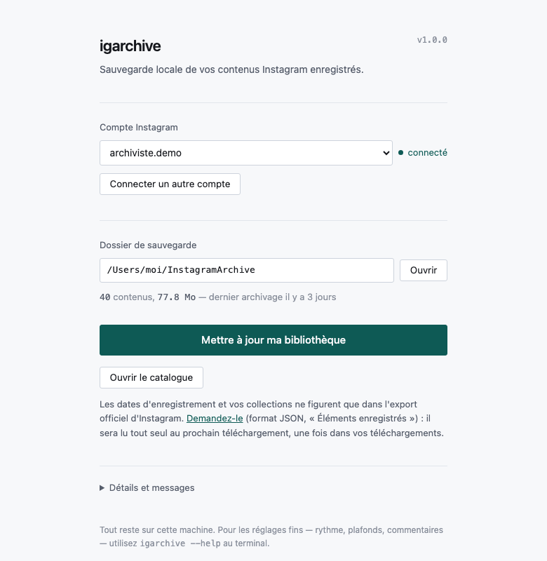
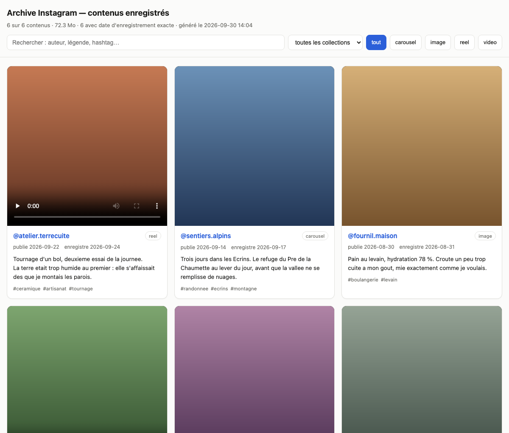

<h1 align="center">igarchive</h1>

<p align="center">
  <b>Sauvegardez votre bibliothèque Instagram « Enregistrés » sur votre propre disque.</b><br>
  Les vidéos, les descriptions, les auteurs — et la date à laquelle vous avez enregistré chaque contenu.
</p>

<p align="center">
  
  
  
  
  
</p>

<p align="center">
  
</p>

---

## Pourquoi

Instagram vous laisse enregistrer des publications et des reels, mais **rien pour les récupérer**.
Un compte se ferme, un contenu disparaît, et votre bibliothèque se vide sans prévenir.

`igarchive` la copie chez vous, une bonne fois, puis se contente de la tenir à jour.

- 🎬 **La vidéo, vraiment** — les fichiers `.mp4`, pas seulement des liens
- 📅 **La date d'enregistrement** — que nul autre outil ne récupère (voir plus bas)
- 🗂️ **Vos collections** — reconstituées en dossiers, comme dans l'application
- 🔎 **Consultable hors ligne** — une page web, un CSV, du JSON
- 🔁 **Reprenable** — coupure, plantage ou blocage : rien n'est jamais refait deux fois
- 🔒 **Entièrement local** — aucun service tiers, aucune IA, aucune télémétrie
- 🧩 **Une seule dépendance** — [instaloader](https://instaloader.github.io/) ; tout le reste est la bibliothèque standard de Python

---

## Installation

```bash
git clone https://github.com/pzeina/instagram-archiver.git
cd instagram-archiver
./install.sh
```

Puis lancez l'interface :

```bash
igarchive
```

Choisissez le compte, le dossier, appuyez sur **Télécharger**. C'est tout.

> [!TIP]
> **Demandez votre export Instagram tout de suite.** Il met plusieurs heures à 48 h à arriver,
> et c'est la seule source des dates d'enregistrement.
> [accountscenter.instagram.com](https://accountscenter.instagram.com/info_and_permissions/dyi/)
> → *Éléments enregistrés* → format **JSON** → toute la durée.
> L'archivage peut tourner sans l'attendre.

---

## Ce que vous obtenez

<p align="center">
  
</p>

Une page à ouvrir dans n'importe quel navigateur, sans connexion : les vidéos se lisent
directement, la recherche porte sur les auteurs, les légendes et les hashtags.

```
~/InstagramArchive/
├── index.html          la page ci-dessus
├── catalog.csv         une ligne par contenu — s'ouvre dans Excel ou Numbers
├── catalog.json        les mêmes données, complètes
├── media/2026/2026-09-22_atelier.terrecuite_Dq1/
│   ├── ….mp4           la vidéo
│   ├── ….jpg           vignette, et chaque image d'un carrousel
│   ├── ….txt           la description
│   └── ….json          la réponse brute d'Instagram, pour vérification
├── collections/        vos collections, en dossiers
│   ├── Poterie/ → liens vers les contenus concernés
│   └── Sans collection/
├── metadata/           une fiche normalisée par contenu
└── state/              le registre de reprise
```

Chaque fiche porte : identifiant, lien, type (`reel` / `video` / `image` / `carousel`), auteur,
date de publication, **date d'enregistrement**, collection, description, hashtags, mentions,
lieu, durée, likes, commentaires, fichiers et taille.

---

## Vos collections, telles que dans l'application

Le dossier `collections/` reproduit l'organisation de votre bibliothèque Instagram. Chaque
entrée est un **lien**, pas une copie : un reel rangé dans trois collections n'occupe la place
qu'une fois, et les liens étant relatifs, l'archive reste déplaçable d'un disque à l'autre.

L'arborescence se reconstruit à chaque `igarchive catalog`. Une collection supprimée dans
l'application disparaît donc d'ici — sans qu'aucun média ne soit touché, le nettoyage ne
retirant que des liens. Les contenus qui n'appartiennent à aucune collection sont regroupés
sous « Sans collection ».

Dans le catalogue, chaque vignette porte ses collections, et le menu déroulant permet de
n'afficher que l'une d'elles.

> Les collections viennent de l'export officiel, comme les dates. Avant son import, tout se
> trouve dans « Sans collection ».

---

## La date d'enregistrement, et pourquoi elle demande un détour

Aucune source ne donne tout :

| Source | Donne | Ne donne pas |
|---|---|---|
| **Export officiel Instagram** | la date exacte d'enregistrement, les collections | les vidéos — seuls *vos* contenus y figurent, pas ceux que vous avez enregistrés |
| **Votre compte connecté** | la vidéo, la description, l'auteur, la date de publication | la date d'enregistrement — seulement l'ordre |

`igarchive` lit les deux et les fusionne par identifiant de contenu. L'export peut arriver
après coup : les fiches déjà écrites sont enrichies, sans rien retélécharger.

**L'import est automatique.** À chaque téléchargement, l'export est cherché dans vos
téléchargements et sur votre bureau, lu en entier même s'il est découpé en plusieurs archives,
et le catalogue est reconstruit dans la foulée. Vous n'avez rien à faire d'autre que le
demander à Instagram. Seules les archives dont le nom évoque Instagram sont ouvertes : vos
autres fichiers ne sont jamais inspectés. (`igarchive dyi` fait la même chose au terminal.)

Tant que l'export n'a pas été importé, le catalogue affiche l'**ordre** d'enregistrement
(« 3ᵉ de la liste ») plutôt qu'une date, et l'explique en tête de page. Une fois importé,
il affiche « enregistré le AAAA-MM-JJ ».

---

## L'interface

Deux réglages et un bouton.

| | |
|---|---|
| **Compte** | La liste des comptes déjà connectés, avec un témoin *connecté* / *session expirée*. Sans compte, un lien vers la page de connexion Instagram et un bouton qui retrouve votre session dans vos navigateurs. |
| **Dossier** | Où l'archive est écrite, et ce qu'elle contient déjà — nombre de contenus, taille, date du dernier archivage. |
| **Télécharger** | Lance la sauvegarde. Pendant qu'elle tourne : les compteurs, le contenu en cours, un bouton pour arrêter. |

Le reste est décidé pour vous, parce que personne n'a besoin de le régler : le rythme des
requêtes, le format récupéré, l'ordre de parcours. L'export officiel est cherché et lu tout seul
à chaque téléchargement.

Un panneau *Détails et messages* garde le journal, les erreurs et la connexion par cookie, sans
les mettre sur le chemin.

**Tout ce qui a été retiré de l'interface reste dans la ligne de commande** — pauses, plafonds,
commentaires, simulation. L'interface sert à sauvegarder sa bibliothèque ; le terminal sert à
tout le reste.

<details>
<summary><b>Si la détection de session échoue</b></summary>

<br>

Ouvrez *Détails et messages* et collez le cookie `sessionid` d'instagram.com. Cela fonctionne
**partout**, y compris sur une machine sans navigateur :

1. Dans votre navigateur, ouvrez les outils de développement sur instagram.com
2. Application → Cookies → `instagram.com` → `sessionid`
3. Copiez la valeur, collez-la dans le champ

Chrome, Safari, Edge et Brave chiffrent leurs cookies ; leur lecture automatique demande un
paquet supplémentaire :

```bash
./install.sh --browsers
```

</details>

---

## Ligne de commande

Tout ce que fait l'interface se fait aussi au terminal — donc depuis une tâche planifiée
ou une machine sans écran.

```bash
igarchive session --user VOTRE_PSEUDO     # ouvrir une session
igarchive dyi                             # trouve l'export tout seul
igarchive dyi --export ~/Downloads/instagram-export.zip   # ou un chemin précis
igarchive fetch --dry-run --limit 20      # aperçu, ne télécharge rien
igarchive fetch                           # archiver
igarchive catalog --open                  # reconstruire et ouvrir
igarchive status                          # où en est-on
```

**Mise à jour ultérieure** — s'arrête dès 20 contenus déjà connus, donc en une minute :

```bash
igarchive fetch --stop-after-known 20 && igarchive catalog
```

<details>
<summary><b>Automatiser (launchd, systemd, cron)</b></summary>

<br>

**macOS — launchd**

```bash
cat > ~/Library/LaunchAgents/com.perso.igarchive.plist <<'PLIST'
<?xml version="1.0" encoding="UTF-8"?>
<!DOCTYPE plist PUBLIC "-//Apple//DTD PLIST 1.0//EN" "http://www.apple.com/DTDs/PropertyList-1.0.dtd">
<plist version="1.0"><dict>
  <key>Label</key><string>com.perso.igarchive</string>
  <key>ProgramArguments</key>
  <array><string>/bin/sh</string><string>-lc</string>
    <string>igarchive fetch --stop-after-known 20 &amp;&amp; igarchive catalog</string></array>
  <key>StartCalendarInterval</key>
  <dict><key>Day</key><integer>1</integer><key>Hour</key><integer>9</integer></dict>
  <key>StandardOutPath</key><string>/tmp/igarchive.log</string>
  <key>StandardErrorPath</key><string>/tmp/igarchive.err</string>
</dict></plist>
PLIST
launchctl load ~/Library/LaunchAgents/com.perso.igarchive.plist
```

**Linux — systemd**

```bash
mkdir -p ~/.config/systemd/user
cat > ~/.config/systemd/user/igarchive.service <<'UNIT'
[Unit]
Description=Archivage des contenus Instagram enregistres
[Service]
Type=oneshot
ExecStart=/bin/sh -lc 'igarchive fetch --stop-after-known 20 && igarchive catalog'
UNIT
cat > ~/.config/systemd/user/igarchive.timer <<'UNIT'
[Unit]
Description=Archivage Instagram mensuel
[Timer]
OnCalendar=monthly
Persistent=true
[Install]
WantedBy=timers.target
UNIT
systemctl --user daemon-reload && systemctl --user enable --now igarchive.timer
```

`Persistent=true` rattrape l'exécution si la machine était éteinte à l'heure prévue.

**Linux — cron**

```cron
0 9 1 * * igarchive fetch --stop-after-known 20 && igarchive catalog
```

Pensez à relancer `igarchive dyi` après chaque nouvel export officiel.

</details>

---

## À savoir avant de lancer

> [!IMPORTANT]
> **Ne raccourcissez pas les pauses.** Instagram limite les comptes qui enchaînent les requêtes.
> Le réglage par défaut (3 à 8 s) donne environ **une heure pour 500 contenus**. Sur une grosse
> bibliothèque, étalez sur plusieurs jours avec `--limit 300`. En cas d'erreur 429, le programme
> s'arrête **de lui-même** et reprend à la passe suivante.

- **Depuis une connexion résidentielle**, pas depuis un VPN ni un serveur loué : les plages
  d'hébergeurs sont bloquées bien plus vite.
- **Ce qui a déjà disparu est perdu.** Un contenu supprimé, ou dont l'auteur est passé en privé,
  est noté `unavailable` et jamais retenté indéfiniment. C'est l'argument pour commencer tôt :
  l'export officiel vous donnera toujours le lien et la date, jamais la vidéo.
- **Statut.** Récupérer ces contenus automatiquement est contraire aux conditions d'utilisation
  d'Instagram, même appliqué à votre propre bibliothèque. Le risque concret est une limitation
  temporaire du compte, que les pauses ci-dessus rendent peu probable.

---

## Vie privée

- **Rien ne sort de votre machine** en dehors des requêtes à Instagram.
- **Aucun mot de passe n'est écrit sur le disque**, quelle que soit la méthode de connexion.
- Le jeton de session vit dans `~/.config/igarchive/sessions/` en droits `600`. Il **vaut un mot
  de passe**. Il est délibérément rangé *hors* de l'archive, pour qu'il ne parte pas avec elle
  sur un disque externe ou dans un nuage.
- L'interface n'écoute que sur `127.0.0.1`, et chaque appel à son API exige un jeton tiré au
  hasard au démarrage : une autre page ouverte dans le même navigateur ne peut pas la piloter.

---

## Dépannage

| Symptôme | Remède |
|---|---|
| « Aucun cookie sessionid » | Vous n'êtes pas connecté à instagram.com dans ce navigateur, ou vous visez le mauvais. |
| « …demande browser_cookie3 » | `./install.sh --browsers`, ou utilisez Firefox, ou collez le cookie. |
| « La session a expiré » | Reconnectez-vous à instagram.com, puis appuyez sur « Connecter ce navigateur ». |
| Erreur 429 | Normal sur une grosse bibliothèque. Attendez une à deux heures : la reprise est automatique. |
| Beaucoup de `unavailable` | Contenus supprimés ou comptes passés en privé. Irrécupérable. |
| Le port 8765 est pris | `igarchive ui --port 8766` |
| Rien ne s'ouvre | Machine sans interface graphique : `igarchive ui --no-open`, puis ouvrez l'adresse affichée. |

---

<details>
<summary><b>Développement</b></summary>

<br>

```bash
python3 -m venv .venv && .venv/bin/pip install -e .
PYTHONPATH=src .venv/bin/python -m unittest discover -s tests -v
```

Les tests n'utilisent que la bibliothèque standard et **ne contactent jamais Instagram**. Ils
couvrent l'analyse de l'export officiel (encodage cassé, champs localisés, fusion des
collections), la configuration, le catalogue (échappement, tri, CSV), la résolution des chemins
sur les deux systèmes — vérifiée en forçant la plateforme — et le serveur de l'interface,
réellement démarré sur un port éphémère.

| Fichier | Rôle |
|---|---|
| `paths.py` | emplacements, différences entre systèmes |
| `config.py` | réglages persistants et leur validation |
| `session.py` | ouverture de session — quatre méthodes |
| `dyi.py` | analyse de l'export officiel |
| `fetch.py` | téléchargement, registre de reprise |
| `catalog.py` | fiche normalisée, sorties CSV / JSON / HTML |
| `jobs.py` | exécution en tâche de fond |
| `webui.py` | serveur local de l'interface |
| `cli.py` | ligne de commande |

`fetch.py` ne connaît ni terminal ni interface : il signale son avancement par un rappel de
fonction, ce qui permet aux deux de partager le même code.

L'interface est servie sur `127.0.0.1` par la bibliothèque standard plutôt que construite avec
une bibliothèque graphique : Tk n'est pas présent dans toutes les installations Python de macOS
et impose un paquet système différent sur chaque distribution Linux.

</details>

---

<p align="center">
  <sub>MIT — voir <a href="LICENSE">LICENSE</a>. Projet indépendant, sans lien avec Meta ni Instagram.</sub>
</p>
